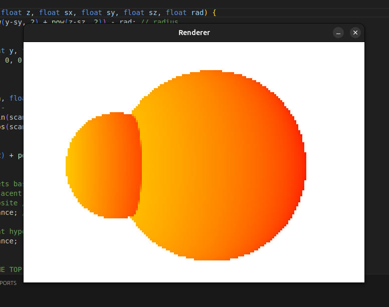

This is a basic raymarching renderer written in C++. It is slower than most as 
it only utilises the GPU for drawing colors to the screen, not the actual rendering. 
I made it for fun and to experiment with the idea of raymarching and signed distance
functions, as well as to practice using C++. It's not (yet) practical for anything.

WASD and arrow keys can be used to navigate.

